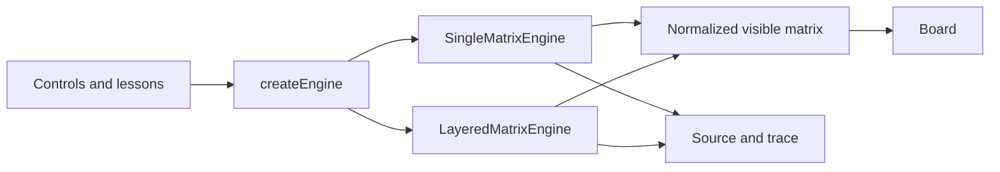

# Tetris Matrix Lab


An interactive laboratory for learning how a Tetris core uses two-dimensional matrices. Play the game, advance one operation at a time, compare two engine implementations, and connect each move to the real JavaScript source code that ran.

## Purpose

The lab connects three views that are often learned separately:

- The visible 10-column by 20-row board.
- The engine state, inspected cells, reads, and writes.
- The real JavaScript method behind the latest operation, with highlighted lines and a short trace.

It is designed for learners with basic JavaScript knowledge who want to observe matrices, transformations, collisions, and algorithmic complexity in action.

## What you can learn

1. **Representation:** one matrix versus separate board, piece, and position layers.
2. **Collisions:** local-to-global coordinate translation and early detection.
3. **Rotation:** a 90-degree matrix transformation validated with wall kicks.
4. **Row clearing:** in-place shifting versus immutable row filtering.
5. **Complexity:** the cells read and writes performed by each operation.

## Technologies

| Technology | Role |
| --- | --- |
| Semantic HTML5 | Accessible structure, controls, board, and teaching panels |
| CSS3 | Responsive layout, visual states, and touch-friendly controls |
| Modern JavaScript | ES modules, engines, rendering, timer, and execution trace |
| Highlight.js 11.12.0 | JavaScript syntax highlighting in the complete-source explorer |
| Node.js 18+ | Local server, dependency installation, and test execution |
| `node:test` | Unit tests and equivalence checks between engines |

The project uses no framework. Highlight.js is distributed locally in `dist/vendor`, so the source viewer works without an internet connection.

## Run locally

Requirements: Node.js 18 or later and a modern browser.

```bash
npm start
```

Open [http://localhost:8080](http://localhost:8080).

Do not open `dist/index.html` directly from the file system: ES modules and source loading require HTTP. The page explains how to start the local server when that happens.

To use another port in PowerShell:

```powershell
$env:PORT=3000
npm start
```

## Controls

The interface provides large controls for mouse and touch input.

| Action | Button | Keyboard |
| --- | --- | --- |
| Move left | Left | `←` |
| Move right | Right | `→` |
| Move down | Down | `↓` |
| Rotate | Rotate | `↑` or `X` |
| Hard drop | Drop | `Space` |
| Run or pause | Run/Pause | `P` |
| Advance manually | One cycle | — |

## How the lab works



Both engines expose the same contract: `step()`, `move(dx)`, `rotate()`, `hardDrop()`, `reset()`, `ghostY()`, and `getVisibleMatrix()`.

Each operation records the decision, inspected cells, reads, writes, teaching steps, the real method to display, and its relevant lines.

The right panel loads the selected engine file directly instead of presenting copied pseudocode. Its default **execution path** view keeps the traversed instructions and nearby context visible. A green `▶ LINE n` cursor follows the code and stays synchronized with the explanatory trace.

Select **Full code** to open the in-page source explorer. It can switch among engines, matrix operations, pieces, the contract, and the interface; color the complete JavaScript file; mark the latest execution path; search text; copy original source; and show concise teaching comments without changing the executed files.

## Memory models

### Single matrix

`SingleMatrixEngine` keeps fixed blocks and the active piece in `matrix[20][10]`:

- `0`: empty cell.
- `1…7`: fixed block.
- `−1…−7`: active piece.

Moving or rotating temporarily erases negative values, validates the candidate state, then paints them again.

### Separate layers

`LayeredMatrixEngine` keeps `board[20][10]` for fixed blocks, `piece.matrix` for the current shape, and `piece.x` / `piece.y` for its position. The board does not change during movement; both layers are composed while rendering.

## Project structure

```text
dist/                 Application source and bundled viewer assets
  index.html
  styles.css
  js/
    engines/          Comparable game-engine implementations
scripts/serve.mjs     Static development server
tests/                Node.js test suite
```

Recommended reading order: `dist/js/matrix.js`, `dist/js/pieces.js`, both files in `dist/js/engines/`, then `dist/js/app.js`.

## Verification

Run syntax validation and tests:

```bash
npm run verify
```

Individual commands are also available:

```bash
npm run check
npm test
```

## Complexity

| Operation | Time | Additional space |
| --- | ---: | ---: |
| Collision | `O(h × w)` for the piece | `O(k)` for inspected cells |
| Rotation | `O(h × w)` for the piece | `O(h × w)` |
| Lock piece | `O(h × w)` for the piece | `O(1)` beyond the board |
| Clear rows | `O(R × C)` for the board | Up to `O(R × C)` in the layered engine |

`R = 20`, `C = 10`, and a tetromino occupies at most a `4 × 4` matrix.
